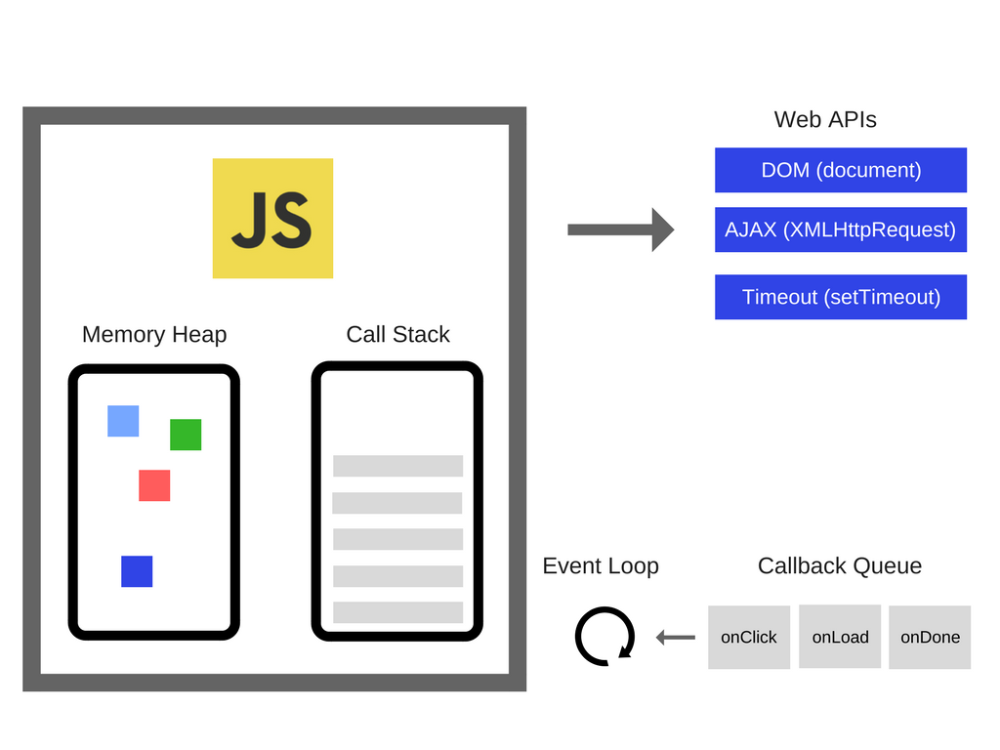

# 비동기프로그래밍
## Why?
비동기 프로그래밍은 자바스크립트의 전부이다!  
물론 이말은 거짓말이다. 하지만 비동기 프로그래밍을 이해하는 것은 자바스크립트 개발자에게 매우 중요하다.  
싱글쓰레드로 동작하는 자바스크립트의 한계를 멋지게 해결하는 방법이다.  
database나 file에 접근하거나, 네트워크 통신이 필요한 경우 등의 작업이 필요하다면, 비동기 처리를 통해서 blocking하지 않고 효과적으로 처리할 수 있다. 이는 자바스크립트기반 애플리케이션의 한계를 넘어서게 하는 필수적인 기능이라고 볼 수 있다.

## 학습 목표
* 동기/비동기의 차이를 이해한다.
* 비동기가 섞여 있을때에도 디버깅을 잘 할 수 있다.
* 배열과 객체 조작에 익숙해진다.

## 배경 지식
#### 동기(synchronous)
```javascript
const baseData = [1,2,3,4,5,6,100];

baseData.forEach((v,i) => {
    console.log("sync ", i);
});

baseData.forEach((v,i) => {
    console.log("sync 2", i);
});
```
동기적인 흐름은 순서대로 실행될 뿐이다. 원활한 프로그램 흐름을 유지해야 함으로 순서가 바뀔 수 없다.

#### call stack
개발자도구의 call stack으로 확인해보기.
```javascript
const baseData = [1,2,3,4,5,6,100];

function foo() {
  baseData.forEach((v,i) => {
    console.log("sync ", i);
    bar();
  });
}

function bar() {
  baseData.forEach((v,i) => {
    //debugger;
    console.log("sync 2", i);
  });
}
```
call stack이 쌓이는 것을 시각적으로 표현해보라!

#### setTimeout과 비동기
만약 setTIme이 동기적으로 실행되면 어떻게 돼지?
```javascript
setTimeout( ()=>console.log(10), 10000);
```
setTimeout함수의 callback 함수는 함수의 인자로 들어가서, 즉시 또는 나중에 실행되는 녀석이다.  
어떻게 동작하는 걸까? 설명해보자.

#### callstack & callback queue

* call stack 그리고, callback queue(또는 stack queue)
* event loop를 통해서 callback queue에 callback함수가 stack으로 올라감.

#### 동기-비동기 순서 이해하기
결과값을 예상해보자.
```javascript
function plus() {
  let a = 1;
  setTimeout( ()=>console.log(++a), 1000);
  return a;
}

const result = plus();
console.log('result :', result);  //?
```

#### 비동기 상황 예
```javascript
const baseData = [1,2,3,4,5,6,100];

const asyncRun = (arr, fn) => {
 for(var i=0; i<arr.length; i++) {
   setTimeout( () => fn(i), 1000);
 }
}

asyncRun(baseData, idx =>console.log(idx));
```

#### 비동기 상황 예 - forEach로 변경해보자.
```javascript
const baseData = [1,2,3,4,5,6,100];

const asyncRun = (arr, fn) => {
   arr.forEach((v,i) => {
     setTimeout( () => fn(i), 1000);
   });
}
asyncRun(baseData, idx =>console.log(idx))
```

#### 비동기 상황 예 - 동기 + 비동기 + 동기
```javascript
const baseData = [1,2,3,4,5,6,100];

function sync() {
  baseData.forEach((v,i) => {
    console.log("sync ", i);
  });
}

const asyncRun = (arr, fn) => {
   arr.forEach((v,i) => {
     setTimeout( () => fn(i), 1000);
   });
}
 

function sync2() {
  baseData.forEach((v,i) => {
    console.log("sync 2 ", i);
  });
}

asyncRun(baseData, idx =>console.log(idx))
sync();
sync2();
```

#### 비동기 상황 예 - 비동기 + 비동기
순서를 예상해보기.  
call stack과 callback queue를 상상하자.
```javascript
const baseData = [1,2,3,4,5,6,100];

const asyncRun = (arr, fn) => {
   arr.forEach((v,i) => {
     setTimeout(() => {
       setTimeout(() => {
         console.log("cb 2");
         fn(i)
        },1000);
       console.log("cb 1");
     }, 1000);
   });
}

asyncRun(baseData, idx =>console.log(idx))
```

#### Event Queue와 call stack 과의 관계
아래 매우 훌륭한 영상을 제대로 보고 이해하자.  
(절반까지만 이해해도 좋다)
[https://www.youtube.com/embed/8aGhZQkoFbQ](https://www.youtube.com/embed/8aGhZQkoFbQ)